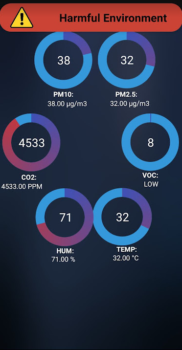

# Air-Quality-Monitoring-System
Air Quality Monitoring System Or AQMS is a Device that can detect pollutants, temperature and humidity. The device is paired with A android mobile application connected via bluetooth

## How To Run the Device
1. Turn on the AQMS device and wait 20 seconds for the sensors to warm up.
2. Turn on the bluetooth of the phone.
3. launch the app and click the bluetooth icon to the app to the device.

## Features
- Detects Pollutants such as: 
  - PM2.5
  - PM10
  - VOC
  - Co2 
 
 
- Detects Temperature and humidity
- Notifies the user when the environment is Hazardous 
